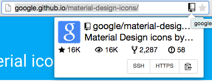

# Pages2Repo

A simple chrome extension that checks the current tab if it is a GitHub pages link (username.github.io/[reponame]). If one is found it will query the GitHub API for info about the repository. You can then click the repository icon in the address bar for a popup with info about the repository as well as links to
- Owners profile (image)
- Repository page
- Stars
- Watchers
- Forks
- Issues
- SSH/HTTPS Clone url (clicking the button will copy to your clipboard (new versions of chrome only?))

## Install
Download from the [chrome webstore](https://chrome.google.com/webstore/detail/pages2repo/afnogakjnebbgcbjkgmhaccljfejeflh)

## Development
You will need to create your own github app and get its corresponding credentials as the redirect URI is unique to each chrome app id. Unless you get it from the webstore you will have a unique id when installing the extension
